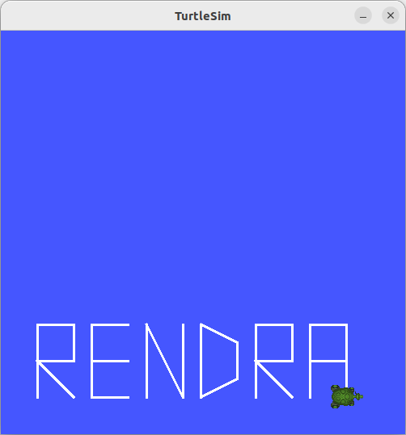

# PENUGASAN TURTLESIM RIVAL ITS

## Biodata Singkat 
| Nama | Divisi | Program Studi |
|------|------|------|
| Narendra Andhi Putra Pratama | Programming| Teknik Elektro |


## Deskripsi Singkat 
Project ini merupakan penugasan magang dari tim RIVAL ITS. Program ini dapat membuat turtlesim mencetak nama yang kita inginkan. Berhubung nama saya adalah Narendra Andhi Putra Pratama, saya mencetak nama panggilan yaitu "RENDRA". Kemudian pada program ini saya punya ide, kalau turtle dapat menulis nama saya dengan teleport. Jadi mekanismenya adalah turtle akan saya teleport ke suatu koordinat yang sebelumnya sudah saya hitung di DESMOS. Kemudian di teleport ke titik tertentu. Jika sudah selesai, pennya akan saya buat false (diangkat), agar ketika diteleport tidak mencoret kanvas.

---
### Code Yang dapat Mencetak RENDRA

1. Cetak Huruf R
```cpp
        case 1:
                RCLCPP_INFO(this->get_logger(), "Menulis huruf R...");

                move_to(2.0, 2.0, 0.0);
                set_pen(true);  // aktifkan pena dengan warna putih

                move_to(2.0, 6.0, 0.0); // garis vertikal
                move_to(4.0, 6.0, 0.0); // atas
                move_to(4.0, 4.0, 0.0); // ke bawah
                move_to(2.0, 4.0, 0.0); // kiri
                move_to(4.0, 2.0, 0.0); // diagonal
                set_pen(false);

                RCLCPP_INFO(this->get_logger(), "Huruf R selesai!");
                break;
```
2. Cetak Huruf E
```cpp
            case 2:
                RCLCPP_INFO(this->get_logger(), "Menulis huruf E...");
                move_to(5.0, 2.0, 0.0);
                set_pen(true);  // aktifkan pena dengan warna putih

                move_to(5.0, 6.0, 0.0); // garis vertikal
                move_to(7.0, 6.0, 0.0); // kanan
                set_pen(false);
                move_to(5.0, 4.0, 0.0); // pindah tengah
                set_pen(true);
                move_to(7.0, 4.0, 0.0); // kanan
                set_pen(false);
                move_to(5.0, 2.0, 0.0); // pindah bawah
                set_pen(true);
                move_to(7.0, 2.0, 0.0); // kanan
                set_pen(false);

                RCLCPP_INFO(this->get_logger(), "Huruf E selesai!");
                break;
```
3. Cetak Huruf N
```cpp
        case 3:
                RCLCPP_INFO(this->get_logger(), "Menulis huruf N...");
                move_to(8.0, 2.0, 0.0);
                set_pen(true);  // aktifkan pena dengan warna putih

                move_to(8.0, 6.0, 0.0); // garis vertikal
                move_to(10.0, 2.0, 0.0); // diagonal bawah
                move_to(10.0, 6.0, 0.0); // vertikal
                set_pen(false);

                RCLCPP_INFO(this->get_logger(), "Huruf N selesai!");
                break;

```
4. Cetak Huruf D
```cpp
        case 4:
                RCLCPP_INFO(this->get_logger(), "Menulis huruf D...");
                move_to(11.0, 2.0, 0.0);
                set_pen(true);  // aktifkan pena dengan warna putih

                move_to(11.0, 6.0, 0.0); // garis vertikal
                move_to(13.0, 5.0, 0.0); // diagonal bawah kanan
                move_to(13.0, 3.0, 0.0); // diagonal bawah
                move_to(11.0, 2.0, 0.0); // diagonal bawah kiri
                set_pen(false);

                RCLCPP_INFO(this->get_logger(), "Huruf D selesai!");
                break;
```
5. Cetak Huruf R
```cpp
        case 5:
                RCLCPP_INFO(this->get_logger(), "Menulis huruf R...");
                move_to(14.0, 2.0, 0.0);
                set_pen(true);  // aktifkan pena dengan warna putih

                move_to(14.0, 6.0, 0.0); // garis vertikal
                move_to(16.0, 6.0, 0.0); // atas
                move_to(16.0, 4.0, 0.0); // ke bawah
                move_to(14.0, 4.0, 0.0); // kiri
                move_to(16.0, 2.0, 0.0); // diagonal
                set_pen(false);

                RCLCPP_INFO(this->get_logger(), "Huruf R selesai!");
                break;
```
6. Cetak Huruf A
```cpp
        case 6:
                RCLCPP_INFO(this->get_logger(), "Menulis huruf A...");
                move_to(17.0, 2.0, 0.0);
                set_pen(true);  // aktifkan pena dengan warna putih

                move_to(17.0, 6.0, 0.0); // garis vertikal
                move_to(19.0, 6.0, 0.0); // kanan
                move_to(19.0, 4.0, 0.0); // ke bawah
                move_to(17.0, 4.0, 0.0); // kiri
                set_pen(false);
                move_to(19.0, 4.0, 0.0); // balik ke tengah
                set_pen(true);
                move_to(19.0, 2.0, 0.0); // bawah

                RCLCPP_INFO(this->get_logger(), "Huruf A selesai!");
                break;
```

---
### Contoh Output yang Dihasilkan
<p align="center">
  
</p>

---
# Sekian Terimakasih
